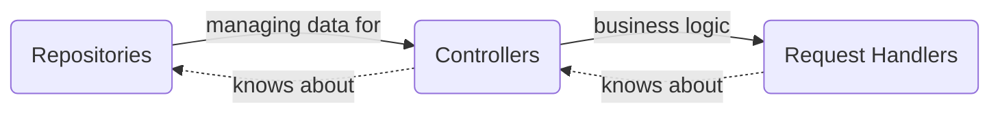
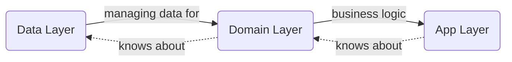

# Verni

Verni is a mobile-first shared expenses tracker that helps you manage shared expenses and balances with friends. Inspired by Splitwise but built with a focus on scalability, reliability, and most importantly - being forever free.

## 🌟 Why Verni?

- **100% Free & Open Source** - No hidden fees, no premium features, just a great expense sharing experience
- **Privacy Focused** - Your data belongs to you, not advertisers
- **Local First** - You can use Verni offline as long as you want and it will sync when you come back online
- **Built to Scale** - Enterprise-grade architecture ensuring reliability at any scale
- **Active Development** - Regular updates and new features based on community feedback

## 🚀 Features

- User authentication with JWT and email verification
- Profile management (change password, email, display name, avatar)
- Expense tracking and splitting
- Balance overview with each friend
- Detailed spending history
- Operations-based CRDT
- Real-time updates and notifications
- Native iOS client with offline support
- Spec-based development ([OpenAPI](https://verni.app/docs))

## 🛠 Tech Stack

### Server Side
- Go 
- PostgreSQL
- JWT authentication
- SMTP email service
- SSE (server-sent events)
- Comprehensive test coverage
- Watchdog service for monitoring
- Push notification support (APNS)

### iOS Client
- Swift 6.0
- SwiftUI
- Strict concurrency model
- Modular architecture with SPM
- URLSession-based networking (SSE), URLSessionTransport (OpenAPI)
- SQLite local storage
- Redux-like state management
- Comprehensive test coverage

## 🏗 Architecture

### Server Architecture
The server follows a layered architecture:

Key Components:
- Services Layer: Handles 3rd party integrations, logging, database, email, etc.
- Repositories Layer: Manages data storage with rollback support
- Controllers Layer: Coordinates repositories for business logic
- Request Handlers Layer: Handles HTTP endpoints and response mapping

### iOS Architecture
The iOS client follows a clean architecture pattern:

Key Components:
- Data Layer: Handles networking, persistence, and data serialization
- Domain Layer: Contains business logic, entities, and use cases
- Presentation Layer: Implements UI using Redux-like pattern with stores and reducers
- Infrastructure Layer: Provides utilities, analytics, and logging

## 🤝 Contributing

We love contributions! Whether you're fixing bugs, improving documentation, or adding new features, your help is welcome.

### Getting Started

1. Choose your area of interest:
   - [Issues](https://github.com/rzmn/verni/issues)

2. Look for issues tagged with:
   - "good first issue"
   - "help wanted"
   - "documentation"
   - "bug"

3. Fork the repository and create your branch from `main`

4. Make your changes and ensure tests pass

5. Submit a pull request!

### How You Can Help

- 🐛 Report bugs
- 💡 Suggest new features
- 📝 Improve documentation
- 🔍 Review code
- ⭐ Star the project to show your support!

When submitting an issue, please ensure your description is clear and includes enough information to reproduce the issue.

## 📜 License

This project is licensed under the MIT License - see the [LICENSE](LICENSE) file for details.

## 🙏 Acknowledgments

Special thanks to all our contributors who help make Verni better every day!

---

Made with ❤️ by the Verni community
 
