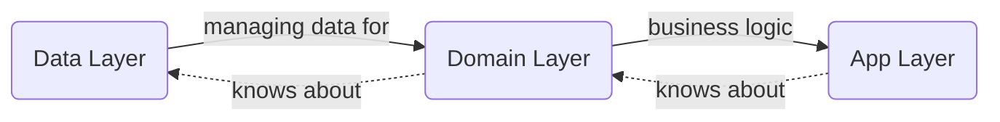
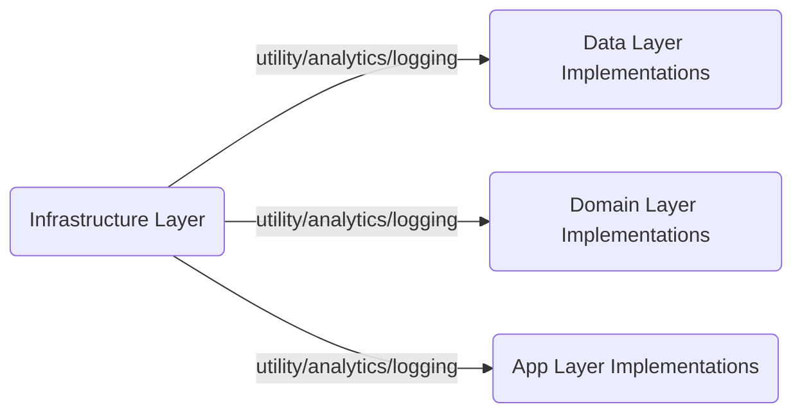
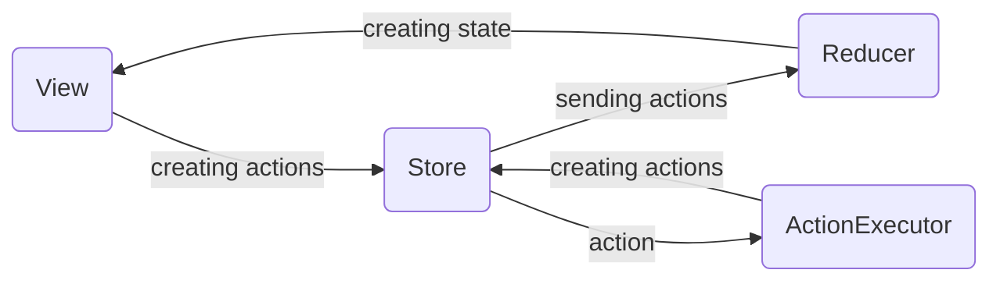

# Verni

Shared Expenses Tracker App iOS Client.

## Tech stack

- swift testing

- strict concurrency

- swiftui

- SPM

## Features

- tbd

## Architecture/Implementation overview

The App's architecture can be considered as a set of _Layers_. Each layer knows only about the "previous" one. 

Each part of domain or data layer has its own *abstract* module containing a set of protocols/entities and at least one *implementation* module. If necessary, implementation modules can be dependent on the infrastructure layer.

  
Dependency graph

No *abstract* module depends on any *implementation* module, which is strictly prohibited to ensure proper encapsulation. It can guarantee that touching implementations will not trigger recompilation of other implementation modules, only that of the final target, which in most cases can leverage incremental compilation.

It is highly recommended to keep *abstract* modules without any dependencies to provide better testability. There may be few exceptions: for example it would be redundant to keep presentation layer parts independent of domain entities.

Each *module* is provided as a *Swift Package*.

### Data Layer

The Data Layer is mostly about how to store, fetch and serialize data.

`DataTransferObjects` - Serializable Data Types

`Networking` - HTTP Networking Service

`ApiService` - Authorization and Data Serialization Service

`Api` - REST API Schema + Polling

`PersistentStorage` - Persistent Data Storage

Networking service is URLSession-based, service is responsible to perform request retries (exponential backoff). Reachability retries are considered to be responsibility of the App Layer. 

Api Service is responsible for refreshing token (JWT) when a request fails due token expiration and then restarting it with a refreshed token. The Api Service can make N requests simultaneously keeping relevant refresh token for each one.

Serialization is Codable-based, the same object types are used both in Api Schema and Persistent Storage. Storage is sqlite3 database.

### Domain Layer

The Domain Layer contains three kind of objects describing business logic

- Entities - pure data representing core concepts of problem domain

- Repositories - read-only data providers

- Use Cases - user scenarios

Repositories are designed to allow subscription to data updates. When repository has a subscription, it is listening for remote updates via api polling. Every data update is cached in persistent storage.

However, Domain Layer has mutable extensions for offline repositories. Is was made for convenient injection in the regular repositories to update caches, keeping proper encapsulation. Mutable extensions are supposed to be unavailable from App Layer, therefore they are not provided by DI, unlike the immutable ones.

Use cases have access to repositories. Use cases are able to provide a "data update hint" to repository to avoid unnecessary api calls. For example if we have a "Profile Repository" for profile that contains an e-mail, when the e-mail is updated by "E-mail Update Use Case", it would be OK for use case to provide just a closure that can update some profile's e-mail to repository, without making api call to get relevant profile info. That closure (one or more, sequential) will be removed on the next api call to get profile. See `ExternallyUpdatable` for implementation details.

### App (Presentation) Layer

The App Layer is a set of _Screens_. _Screen_ is a complete and reusable fragment of some user story. _Screen_ should be able to appear from anywhere.

Each _Screen_ is provided as a _Swift Package_. Each *Screen* is not dependent on any other _Screen_.

### Screen Components

#### Flow

- Entry point for some user path as described above

- The only public entity in a corresponding swift package

- Interacts with domain layer. (Use Cases, Repositories, Entities)

- _Presenter_ and _ViewModel_ are created by a _Flow_

- Listening for _User Actions_

- Sending updates to _ViewModel_
  
  #### Presenter

- Responsible for UI presentation (view controllers, HUDs, popups etc)

- Interacts with _AppRouter_. _AppRouter_ provides an information about current navigation state.

- _View_ is created by a _Presenter_
  
  #### ViewModel

- Responsible for creating and publishing a _ViewState_ to _ViewActions_

- _ViewModel_ is istening for updates from _Flow_. _ViewState_ is being created based on that updates
  
  #### ViewActions

- Publishing _ViewState_ to _View_

- Listening for user actions from _View_
  
  #### View

- Passive

- Listening for _ViewState_ from _ViewActions_ and renders it

