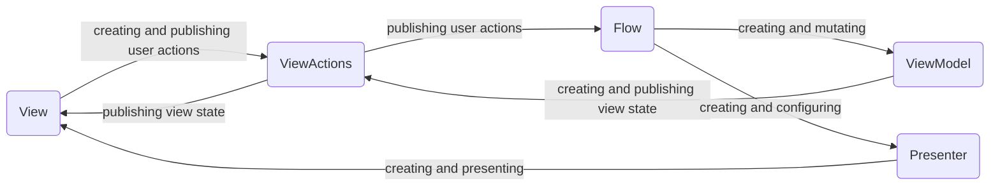
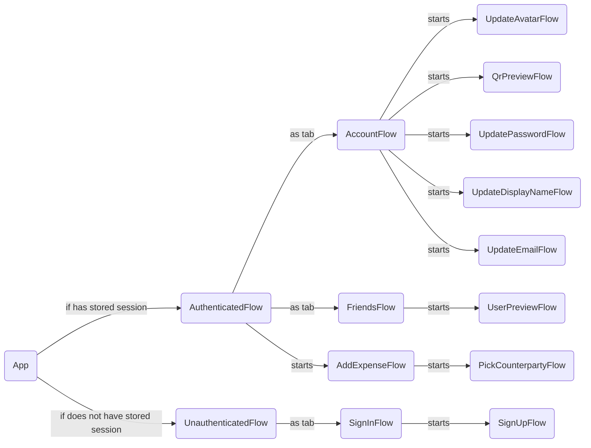

# App

## Architecture overview

### Flow

_Flow_ is a complete fragment of some user path.
_Flow_ is presenting and dismissing itself on its own. Flow should be able to start everywhere.

It is convenient to consider _Flow_ as a single async function:
```swift
public protocol Flow {
    associatedtype FlowResult
    func perform() async -> FlowResult
}
```

<details>
  <summary>Example (Flow for asking for push notification permission)</summary>

```swift
actor AskForPushNotificationPermissionFlow: Flow {
    enum Verdict {
        case allowed, denied
    }
    func perform() async -> Verdict {
        let allowed = await UNUserNotificationCenter.current()
            .requestAuthorization(options: [.alert, .sound, .badge])
        return allowed ? .allowed : .denied
    }
}
```
</details>

Every _Flow_ is provided as a _Swift Package_.

### Flow Components

#### Flow
- Entry point for some user path as described above.
- Interacts with domain layer. (Use Cases, Repositories, Entities)
- _Presenter_ and _ViewModel_ are created by a _Flow_
- Listening for _User Actions_
- Sending updates to _ViewModel_
#### Presenter
- Responsible for UI presentation (view controllers, HUDs, popups etc)
- Interacts with _AppRouter_. _AppRouter_ provides an information about current navigation state.
- _View_ is created by a _Presenter_
#### ViewModel
- Responsible for creating and publishing a _ViewState_ to _ViewActions_
- _ViewModel_ is istening for updates from _Flow_. _ViewState_ is being created based on that updates
#### ViewActions
- Publishing _ViewState_ to _View_
- Listening for user actions from _View_
#### View
- Passive
- Listening for _ViewState_ from _ViewActions_ and renders it



### Flow hierarchy

Each flow knows about its direct children only


