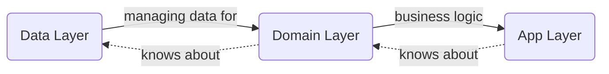
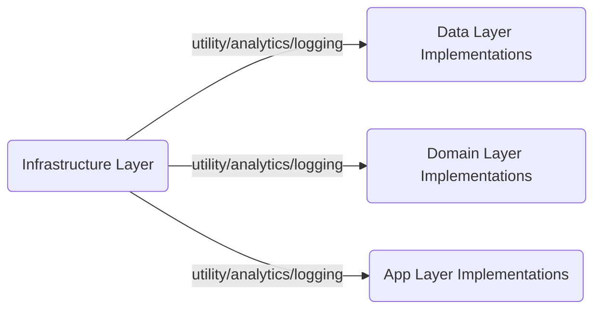
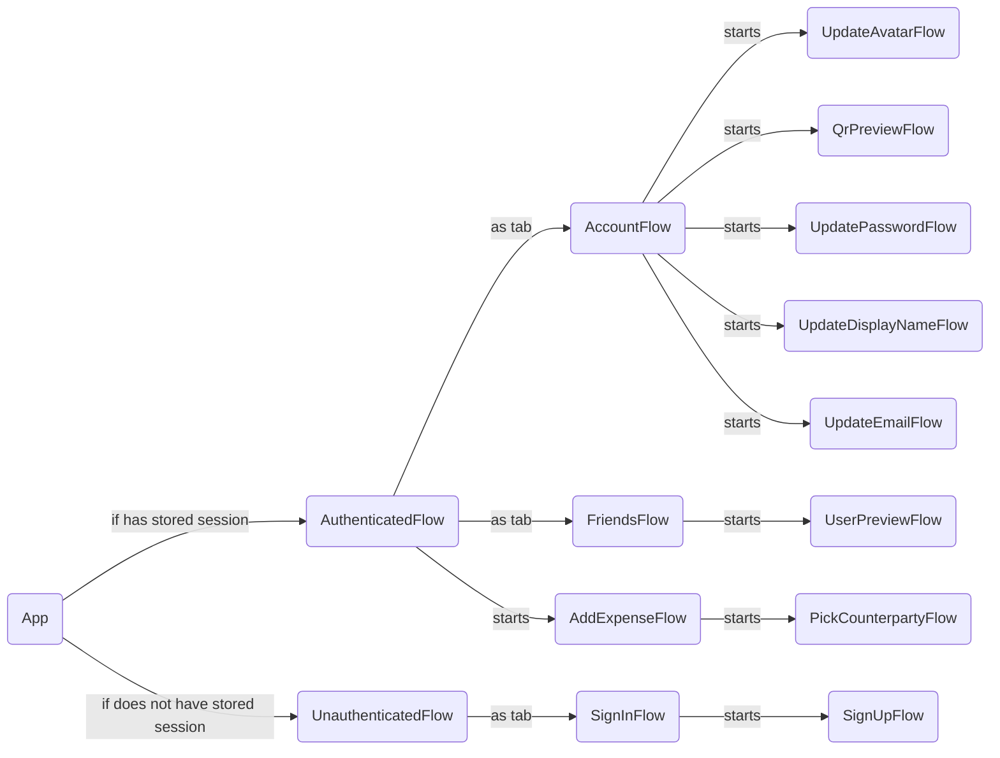

# The App

## Architecture overview

The App's architecture can be considered as a set of _Layers_. Each layer knows only about the "previous" one. 



Each part of domain or data layer has its own *abstract* module containing a set of protocols/entities and at least one *implementation* module. If necessary, implementation modules can be dependent on the infrastructure layer.



No *abstract* module depends on any *implementation* module, which is strictly prohibited to ensure proper encapsulation. It can guarantee that touching implementations will not trigger recompilation of other implementation modules, only that of the final target, which in most cases can leverage incremental compilation.

It is highly recommended to keep *abstract* modules without any dependencies to provide better testability. There may be few exceptions: for example it would be redundant to keep presentation layer parts independent of domain entities.

Each *module* is provided as a *Swift Package*.

### Data Layer

### App (Presentation) Layer

The App Layer is a set of _Flows_. _Flow_ is a complete and reusable fragment of some user path.

_Flow_ is presenting and dismissing itself on its own. _Flow_ should be able to start from anywhere.

It's convenient to consider _Flow_ as a single async function:

```swift
public protocol Flow {
    associatedtype FlowResult
    func perform() async -> FlowResult
}
```

<details>
  <summary>Example (Flow for asking for push notification permission)</summary>

```swift
actor AskForPushNotificationPermissionFlow: Flow {
    enum Verdict {
        case allowed, denied
    }
    func perform() async -> Verdict {
        let allowed = await UNUserNotificationCenter.current()
            .requestAuthorization(options: [.alert, .sound, .badge])
        return allowed ? .allowed : .denied
    }
}
```

</details>

Each _Flow_ is provided as a _Swift Package_.

### Flow Components

#### Flow

- Entry point for some user path as described above

- The only public entity in a corresponding swift package

- Interacts with domain layer. (Use Cases, Repositories, Entities)

- _Presenter_ and _ViewModel_ are created by a _Flow_

- Listening for _User Actions_

- Sending updates to _ViewModel_
  
  #### Presenter

- Responsible for UI presentation (view controllers, HUDs, popups etc)

- Interacts with _AppRouter_. _AppRouter_ provides an information about current navigation state.

- _View_ is created by a _Presenter_
  
  #### ViewModel

- Responsible for creating and publishing a _ViewState_ to _ViewActions_

- _ViewModel_ is istening for updates from _Flow_. _ViewState_ is being created based on that updates
  
  #### ViewActions

- Publishing _ViewState_ to _View_

- Listening for user actions from _View_
  
  #### View

- Passive

- Listening for _ViewState_ from _ViewActions_ and renders it


### Flow hierarchy

Each flow knows about its direct children only


