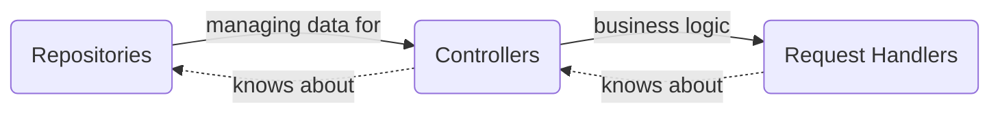
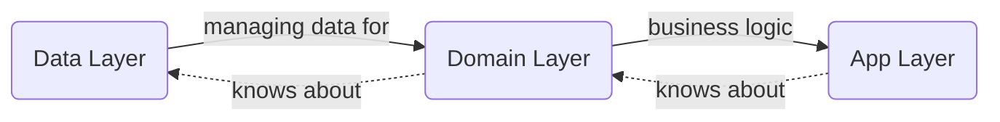
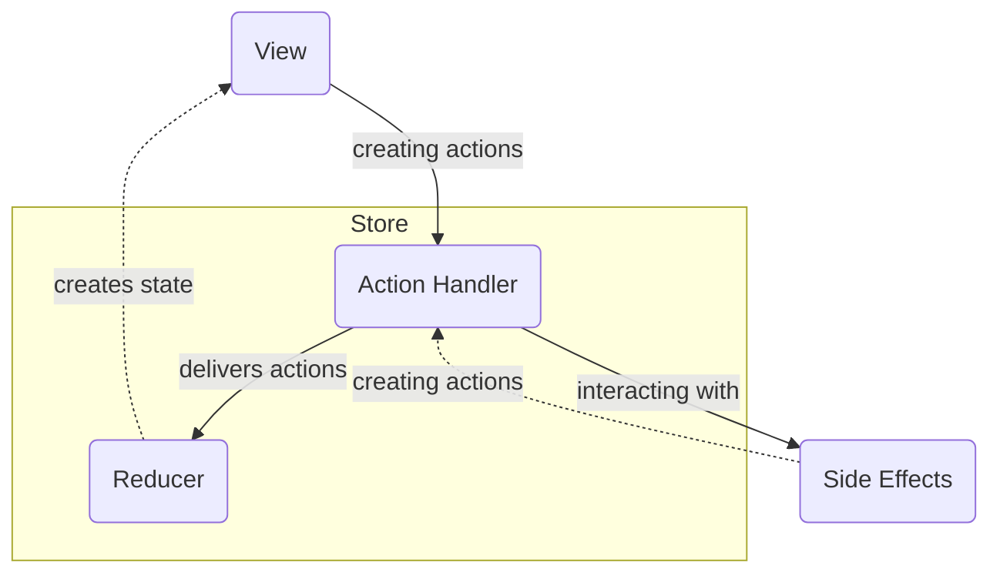

# Verni

Verni is an open-source app inspired by Splitwise that puts simplicity, privacy, and reliability first. We're creating a powerful yet intuitive shared expenses tracker that helps you manage costs with friends - without the bloat, without the premium features, forever free and open source.

## 🌟 Why Verni?

- **True Open Source Alternative** - A 100% free and transparent alternative to commercial expense trackers. No paywalls, no premium features, no compromises.
- **Privacy You Can Trust** - Your financial data stays yours. No ads, no tracking, no data mining - just a clean, private expense tracking experience.
- **Works Without Internet** - Experience full functionality offline:
  - Track expenses anytime, anywhere
  - All data stored locally on your device
  - Sync automatically when connection returns
  - Keep working even if our servers are down
- **Start Solo, Go Social** - Begin using Verni without even creating an account. Track your expenses offline, then seamlessly connect with friends and sync your data when you're ready.
- **Built for Reliability** - Enterprise-grade architecture ensures your financial data is always safe and accessible, whether you're online or offline.

## 🌱 Project Status

We're in the exciting early stages of development - perfect timing for new contributors to make a real impact! While we have a solid system design in place, there are plenty of opportunities to help:

- ✅ Improve test coverage across domain/data/infrastructure layers
- 🐛 Help identify and fix early-stage bugs
- 📚 Contribute to documentation

This is an ideal moment to join if you want to influence the project's direction and gain experience building a production-grade application from the ground up. Every contribution, big or small, makes a difference!

### Implemented Core Features
- Multi-device authentication with JWT
- User profile system
- Basic expense tracking and splitting
- Real-time updates via SSE

### In Development (UI/UX Layer)
Currently implementing UI for:
- Login flow
- Profile management
- Expense list view
- Expense creation

### Planned for 2025
- Complete expense management UI
- Friend system implementation
- Balance calculations
- Transaction history
- Push notifications
- Email notifications

Note: The set of features has been developed at the use case level, but is not ready enough at the user interface level and will be published later. (Expected for May-June 2025) At the moment, the interface is implemented for the login, profile card, expense list and the expense add screen.

## 🛠 Tech Stack

### Server (Go)
- **Core**
  - Go 1.22
  - PostgreSQL
  - OpenAPI code generation
  
- **Communication**
  - Server-Sent Events (SSE)
  - JWT auth
  - APNS for iOS notifications
  - SMTP email service
  
- **Infrastructure**
  - CI/CD with GitHub Actions
  - Telegram alerts
  - Test coverage tracking

### iOS (Swift)
- **Platform**
  - Swift 6.0
  - SwiftUI
  - Async-Await
  - Strict concurrency model
  
- **Architecture**
  - SPM modules
  - Clean Architecture
  - Redux for the presentation Layer
  
- **Data Manipulation**
  - OpenAPI clients
  - SSE support
  - URLSession transport
  - SQLite storage
  - Operation-based CRDT for keeping app state

Great project to learn:
- Local-First implementation
- Real-time sync implementation
- Highly modular architecture
- Type-safe API development

## 👩‍💻 Usage

### iOS client
- Open `iosclient/Verni.xcodeproj`
- Run `Verni` scheme

### Go server
1. Install PostgreSQL, make a user and database managed by this user
<details>
<summary>Code snippet from VPS setup script for Verni Web Service</summary>

```sh
if ! sudo -u postgres psql -tAc "SELECT 1 FROM pg_database WHERE datname = '${VERNI_DB_NAME}'" | grep -q 1; then
    echo "Creating database ${VERNI_DB_NAME}"
    sudo -u postgres psql -c "CREATE DATABASE ${VERNI_DB_NAME};"
else
    echo "Database ${VERNI_DB_NAME} already exists"
fi

if ! sudo -u postgres psql -tAc "SELECT 1 FROM pg_user WHERE usename = '${VERNI_DB_USER}'" | grep -q 1; then
    echo "Creating user ${VERNI_DB_USER}"
    sudo -u postgres psql -c "CREATE USER ${VERNI_DB_USER} WITH SUPERUSER PASSWORD '${VERNI_DB_PASSWORD}';"
else
    echo "User ${VERNI_DB_USER} already exists"
fi
```

</details>

2. Create service config
<details>
<summary>Verni Web Service Config Example</summary>

```json
{
  "storage": {
    "type": "postgres",
    "config": {
      "host": "123hjg.com",
      "port": 2145,
      "user": "213jhg123",
      "password": "312hg",
      "dbName": "2j1h3g"
    }
  },
  "pushNotifications": {
    "type": "apns",
    "config": {
      "certificatePath": "./some/path/certificate.p12",
      "credentialsPath": "./some/path/credentials.json"
    }
  },
  "emailSender": {
    "type": "yandex",
    "config": {
      "address": "dfsjh123@yyye.ru",
      "password": "gzzcmxyjpksxcxje",
      "host": "smtp.21hg3f123hgf.ru",
      "port": "213"
    }
  },
  "jwt": {
    "type": "default",
    "config": {
      "accessTokenLifetimeHours": 1,
      "refreshTokenLifetimeHours": 720,
      "refreshTokenSecret": "2hj1g3jh123g",
      "accessTokenSecret": "213hjg12jh123"
    }
  },
  "server": {
    "type": "default",
    "config": {
      "timeoutSec": 4,
      "idleTimeoutSec": 60,
      "runMode": "release",
      "port": "4321"
    }
  },
  "watchdog": {
    "type": "telegram",
    "config": {
      "token": "312jhg312j",
      "channelId": -1234
    }
  }
}
```

</details>

3. Create tables
```sh
cd ./server/cmd/utilities
go build .
 ./utilities --command create-tables --config-path ./path/to/your/config.json --config-key-path .storage.config
```
4. Run service
```sh
cd ./server/
go build cmd/verni/main.go
./main --config-path ./path/to/your/config.json
```

## 🏗 Architecture

Both server and iOS client follow a layered architecture. No *abstract* module depends on any *implementation* module, which is strictly prohibited to ensure proper encapsulation. It can guarantee that touching implementations will not trigger recompilation of other implementation modules, only that of the final target, which in most cases can leverage incremental compilation.

### Server Architecture



Key Components:
- Repositories Layer: Manages data storage with rollback support
- Controllers Layer: Coordinates repositories for business logic
- Request Handlers Layer: Handles HTTP endpoints and response mapping
- Services Layer: Handles 3rd party integrations, logging, databases, email, etc.

### iOS Architecture
The iOS client follows a clean architecture pattern:



Key Components:
- Data Layer: Handles networking, persistence, and data serialization
- Domain Layer: Contains business logic, entities, and use cases
- Presentation Layer: Implements UI using Redux-like pattern with stores and reducers
- Infrastructure Layer: Provides utilities, logging, another system-wide things

#### App (Presentation) Layer

The App Layer is a set of _Screens_. _Screen_ is a complete and reusable fragment of some user story. _Screen_ should be able to appear from anywhere. Navigation is being managed by screen coordinator

Each _Screen_ is provided as a _Swift Package_. Each *Screen* is not dependent on any other _Screen_. The screen itself is made up of redux-like components:



#### View

- View is a function of state
- Subscribed to state updates
- Sending user actions

<details>
  <summary>View Example Implementation</summary>

```swift
struct ExampleView: View {
    @ObservedObject private var store: Store<State, Action>

    var body: some View {
        Button {
            store.dispatch(.buttonTapped)
        } label: {
            Text(store.state.buttonTitle)    
        }
    }
}
```

</details>

#### Store

- Responding to user actions
- Holds screen state

<details>
  <summary>Store Example Implementation</summary>

```swift
class ExampleStore<State, Action>: Store {
    @Published var state: State
    private var handlers: [ActionHandler<Action>]
    private let reducer: (State, Action) -> State

    func dispatch(action: Action) {
        state = reducer(state, action)
        for handler in handlers {
            handler.handle(action)
        }
    }
}
```

</details>

#### Reducer

- Pure function returning a new state based on user action and the prevous state

#### Action Handler

- Handling user actions
- Dealing with side effects
- Producing new actions if necessary

<details>
  <summary>Action Handler Example Implementation</summary>

```swift
class ExampleActionHandler<Action>: ActionHandler {
    private unowned let store: Store<State, Action>
    private let api: Api

    func handle(action: Action) {
        switch action {
        case .onRefreshDataTap: refreshData()
        default: break
        }
    }

    private func refreshData() {
        store.dispatch(.dataIsLoading)
        Task {
            do {
                let data = try api.loadData()
                store.dispatch(.dataLoaded(data))
            } catch {
                store.dispatch(.loadDataFailed(error))
            }
        }
    }
}
```

</details>

## 📜 License

This project is licensed under the MIT License - see the [LICENSE](LICENSE) file for details.

---

<p align="center">❤️</p>
