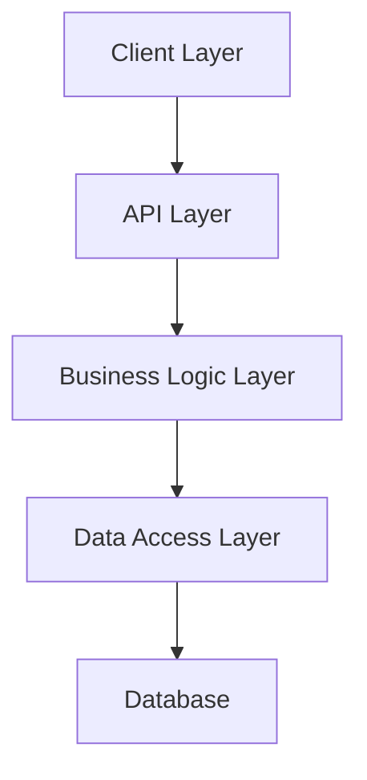

# Architecture Overview

## System Architecture

Verni follows a clean architecture pattern with clear separation of concerns across both server and client components.

## Server Architecture

### Layer Structure

1. **HTTP Layer** (`/internal/openapi`)
   - Generated from OpenAPI specification
   - Request/response handling
   - Route definitions

2. **Controllers** (`/internal/controllers`)
   - Business logic coordination
   - Use case implementation
   - Service orchestration

3. **Repositories** (`/internal/repositories`)
   - Data access abstraction
   - Transaction management
   - Entity persistence

4. **Services** (`/internal/services`)
   - External integrations
   - Cross-cutting concerns
   - Utility functions

## iOS Architecture

### Layer Structure

1. **Presentation Layer** (`/Packages/App`)
   - SwiftUI Views
   - ViewModels
   - State Management

2. **Domain Layer** (`/Packages/Domain`)
   - Business Logic
   - Use Cases
   - Entity Definitions

3. **Data Layer**  (`/Packages/Data`)
   - API Client
   - Local Storage
   - Data Sync

4. **Infrastructure** (`/Packages/Infrastructure`)
   - External integrations
   - Cross-cutting concerns
   - Utility functions

### Module Organization 