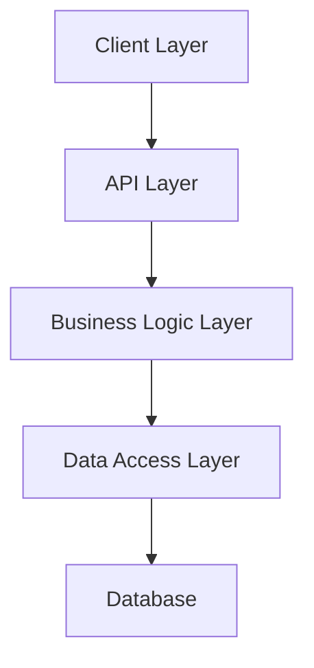
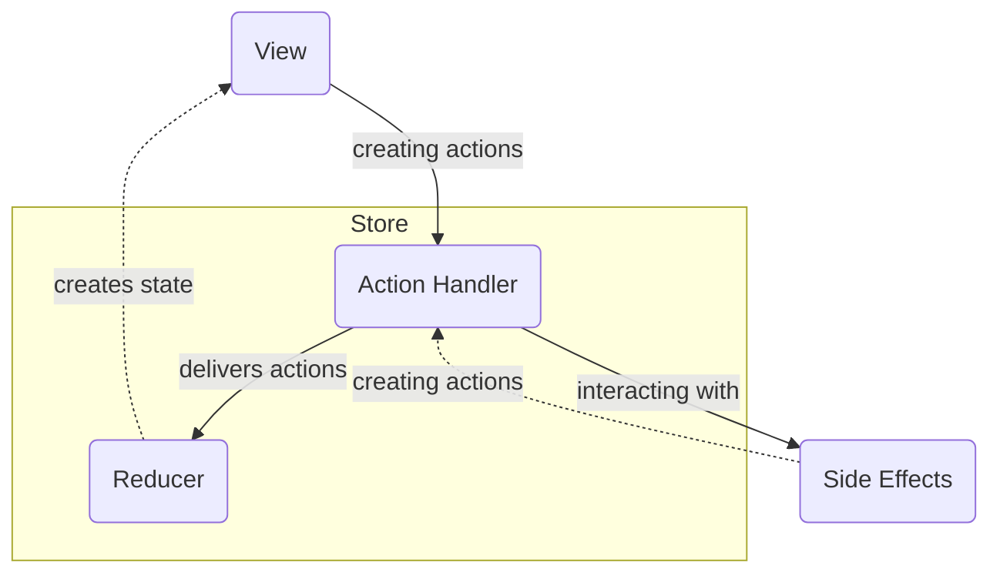

# Architecture Overview

## System Architecture

Verni follows a clean architecture pattern with clear separation of concerns across both server and client components.



## Server Architecture

### Layer Structure

1. **HTTP Layer** (`/internal/openapi`)
   - Generated from OpenAPI specification
   - Request/response handling
   - Route definitions

2. **Controllers** (`/internal/controllers`)
   - Business logic coordination
   - Use case implementation
   - Service orchestration

3. **Repositories** (`/internal/repositories`)
   - Data access abstraction
   - Transaction management
   - Entity persistence

4. **Services** (`/internal/services`)
   - External integrations
   - Cross-cutting concerns
   - Utility functions

## iOS Architecture

### Layer Structure

1. **Presentation Layer** (`/Packages/App`)
   - SwiftUI Views
   - ViewModels
   - State Management

2. **Domain Layer** (`/Packages/Domain`)
   - Business Logic
   - Use Cases
   - Entity Definitions

3. **Data Layer**  (`/Packages/Data`)
   - API Client
   - Local Storage
   - Data Sync

4. **Infrastructure** (`/Packages/Infrastructure`)
   - External integrations
   - Cross-cutting concerns
   - Utility functions

### Module Organization 

No *abstract* module depends on any *implementation* module, which is strictly prohibited to ensure proper encapsulation. It can guarantee that touching implementations will not trigger recompilation of other implementation modules, only that of the final target, which in most cases can leverage incremental compilation.

#### Detailed overview of the Presentation Layer

The App Layer is a set of _Screens_. _Screen_ is a complete and reusable fragment of some user story. _Screen_ should be able to appear from anywhere. Navigation is being managed by screen coordinator

Each _Screen_ is provided as a _Swift Package_. Each *Screen* is not dependent on any other _Screen_. The screen itself is made up of redux-like components:



#### View

- View is a function of state
- Subscribed to state updates
- Sending user actions

```swift
struct ExampleView: View {
    @ObservedObject private var store: Store<State, Action>

    var body: some View {
        Button {
            store.dispatch(.buttonTapped)
        } label: {
            Text(store.state.buttonTitle)    
        }
    }
}
```

#### Store

- Responding to user actions
- Holds screen state

```swift
class ExampleStore<State, Action>: Store {
    @Published var state: State
    private var handlers: [ActionHandler<Action>]
    private let reducer: (State, Action) -> State

    func dispatch(action: Action) {
        state = reducer(state, action)
        for handler in handlers {
            handler.handle(action)
        }
    }
}
```

#### Reducer

- Pure function returning a new state based on user action and the prevous state

#### Action Handler

- Handling user actions
- Dealing with side effects
- Producing new actions if necessary

```swift
class ExampleActionHandler<Action>: ActionHandler {
    private unowned let store: Store<State, Action>
    private let api: Api

    func handle(action: Action) {
        switch action {
        case .onRefreshDataTap: refreshData()
        default: break
        }
    }

    private func refreshData() {
        store.dispatch(.dataIsLoading)
        Task {
            do {
                let data = try api.loadData()
                store.dispatch(.dataLoaded(data))
            } catch {
                store.dispatch(.loadDataFailed(error))
            }
        }
    }
}
```
