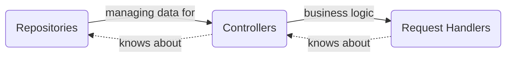

 

---
# Verni
Open-source shared expenses tracker

**Project is under development.**
# Table of Contents
1. [👋 About](https://github.com/rzmn/governi?tab=readme-ov-file#about)
2. [👀 What's Verni?](https://github.com/rzmn/governi?tab=readme-ov-file#whats-verni)
3. [📋 Tech Stack](https://github.com/rzmn/governi?tab=readme-ov-file#tech-stack)
4. [🚀 Features](https://github.com/rzmn/governi?tab=readme-ov-file#features)
5. [💡 Architecture Overview](https://github.com/rzmn/governi?tab=readme-ov-file#architecture-overview)
6. [⚙️ Implementation Overview](https://github.com/rzmn/governi?tab=readme-ov-file#implementation-overview)
7. [🤝 Contributing](https://github.com/rzmn/governi?tab=readme-ov-file#contributing)
## About
This project started as a system design practice. Over time, it evolved into the idea of ​​a product whose core value would be the scalability and reliability of the components it was made of. Components mean all stages of the implementation: starting from the codebase and ending with the design system.

The main feature for final users is a complete absence of a desire to monetize user journeys. The user's needs should be met in the simplest possible way, forever free.
## What's Verni?
Verni is a mobile-first shared expenses tracker mostly inspired by [splitwise](https://www.splitwise.com/). The app keeps track of your shared expenses and balances with friends. 

[Verni iOS Client](https://github.com/rzmn/swiftverni/)

## Tech Stack
- Go
- Gin (HTTP)
- PostgreSQL
## Features
- User authentication (JWT)
- Account verification (via email)
- Profile editing (change password, email, display name, avatar etc.)
- Send/Accept/Reject/Rollback friend request
- List of friends/subscribers/subscriptions
- Add/Remove spending
- List of balances with each user
- Spendings history with each user
## Architecture Overview
The App's architecture can be considered as a set of _Layers_. Each layer knows only about the layer "below".

Each part of domain or data layer has its own *abstract* module containing a set of interfaces/entities and at least one *implementation* module. If necessary, implementation modules can be dependent on the [Services Layer](https://github.com/rzmn/governi?tab=readme-ov-file#services-layer).

No *abstract* module depends on any *implementation* module, which is strictly prohibited to ensure proper encapsulation. It can guarantee that touching implementations will not trigger recompilation of other implementation modules, only that of the final target, which in most cases can leverage incremental compilation. It is highly recommended to keep *abstract* modules without any dependencies to provide better testability.

## Implementation Overview
### Services Layer
Service is an abstraction over some 3rdparty library (like JWT or some hashing algorithms) or some real-world event (SMTP, logging, databases etc.) to ensure the possibility to mock or replace them.

- `watchdog` - interface for sending alerts as files or messages. Current implementation is sending notifications to telegram channel.
- `logging` - logging interface with severity support. Current implementation is writing every message to local db and sending notifications to `watchdog` service when called with `error/fatal` severity level attaching last 1000 sent messages.
- `db` - interface which `database/sql` functions conform with. Current implementation is a `PostgreSQL` driver.
- `emailSender` - interface for sending email messages. Current implementation is a Yandex SMTP service.
- `formatValidation` - interface for various data types format validation, like display names, emails, passwords. If necessary, it can be split into a set of separate interfaces for each data type.
- `realtimeEvents` - service for realtime user notifications. Gin-based HTTP long-polling is a current implementation.
- `jwt` - Json Web Tokens standart interface. Using a wrapper around 3rdparty library is a current implementation.
- `pathProvider` - interface for getting absolute paths from relative independently from location of the binary file. Using value from environment is a current implementation.
- `pushNotifications` - interface for sending push notifications. Current implementation supports APNS.
### Repositories Layer
Repository is an abstraction over some data storage. Each repository should provide an access to certain problem domain. Each mutable (update/delete/insert) action should return an instance of "transaction" object which can rollback performed action.
### Controllers Layer
Controller is responsible to do data manipulations to perform some product use case. Usually controller is a coordinator of several repositories. Example: to get a "Profile Info" info you have to query both `auth` and `users` repository to get private(eg email or verification status) and public(display name or avatar) account data.
### Request Handlers Layer
The topmost layer. Each request handler provides an action to be performed when the corresponding URL is called. In most cases Request Handler is a decorator over some Controller that interacts with notification services (push, polling etc) and maps Controllers entities into serializable ones

## Contributing

Contributing is more than welcome, feel free to take a look at the [issues page](https://github.com/rzmn/governi/issues). Thanks!

How To Contribute:

- Report issues you're facing
- Give a 👍 on issues that are relevant to you
- Answer queries on the issue tracker

If you don't know where to start:

- Navigate to the [issues page](https://github.com/rzmn/governi/issues)
- Filter by label
- Look for issues related to [good first issue](https://github.com/rzmn/governi/issues?q=is%3Aopen+is%3Aissue+label%3A%22good+first+issue%22)

When submitting an issue, please make sure your description is clear and has enough information for someone to be able to reproduce the issue
